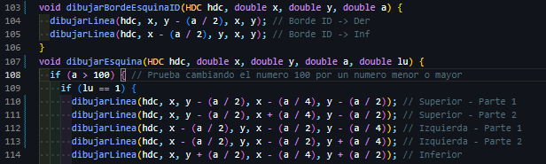
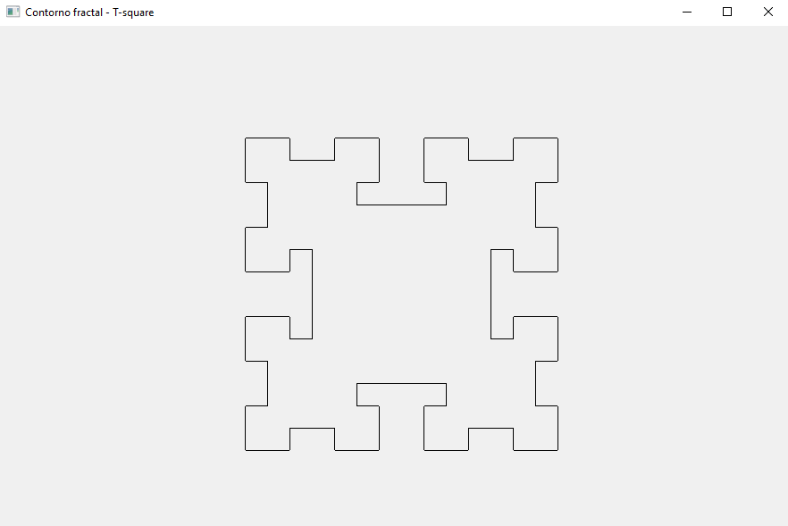

# Contorno Fractal - T-square
## Compilar
Para compilar el código simplemente abra su terminal y ejecute:
```
g++ -mconsole -mwindows .\contorno_fractal_t_square.cpp -o .\output.exe
```

En la linea 109, puedes cambiar el numero 100 por un número mas pequeño o uno más grande.  


Aquí te dejo algunos ejemplos:
* Con 100  

* Con 50  

* Con 25  

* Con 12  

* Con 6  


De las capturas de pantalla, ¿Te diste cuenta de un pequeño detalle?. Pues, ese espacio que apenas se logra ver entre las lineas es porque la primera linea se dibuja de izquierda a derecha y la segunda linea se dibuja de derecha a izquierda. Ahora, para poder eliminar ese espacio entre lineas se tiene que dibujar la primera linea de izquierda a derecha y luego la segunda linea de izquierda a derecha. Para probarlo, vamos a dibujar lineas para ambos casos, el código para dibujar las lineas lo puedes encontrar en el archivo `dibujando_lineas_prueba.cpp`.

En papel:  


Con código:  


Más información: https://en.wikipedia.org/wiki/T-square_(fractal)