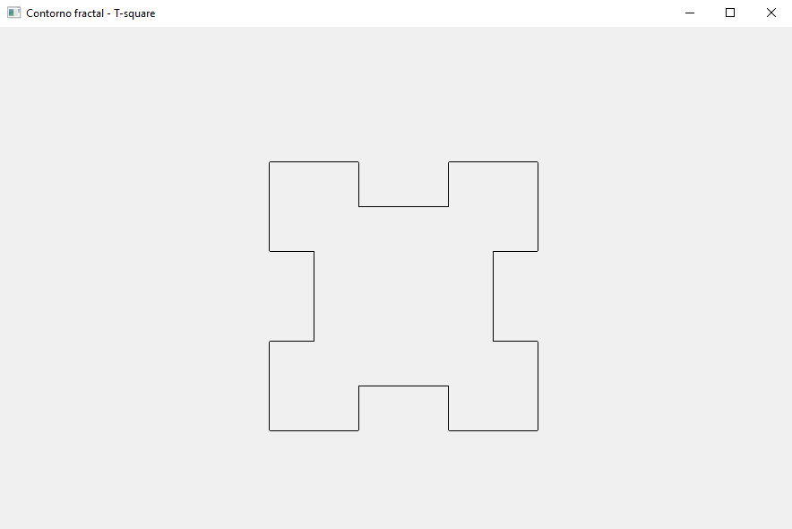

# Contorno Fractal - T-square


## Compilar
Para compilar el código simplemente abra su terminal y ejecute:
```
g++ -mconsole -mwindows .\contorno_fractal_t_square.cpp -o .\output.exe
```

En la linea 108, puedes cambiar el numero 100 por un número mas pequeño o uno más grande.  


Aquí te dejo algunos ejemplos:
* Con 100  

* Con 50  

* Con 25  

* Con 12  

* Con 6  


## Nota
Para dibujar 2 o más lineas debes tener en cuenta la dirección ya que puede que obtengas espacios entre lineas, es por eso que hice 3 pruebas para que veas como se dibujan las lineas en distintas direcciones. El ejemplo lo puedes en contrar en el archivo `dibujando_lineas_prueba.cpp`.

En papel:  


Con código:  


Más información: https://en.wikipedia.org/wiki/T-square_(fractal)