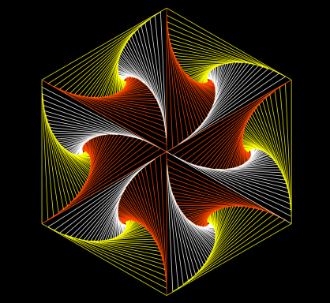

# Computación Gráfica
## Insertar 4
pelotitas con diferentes longitudes de radio (4r, 2r, r y r/2). Las
pelotitas deben estar rebotando dentro de la pantalla, si llegan a
colisionar deben subdividirse en 3 pelotitas y reducir su radio a la mitad. cuando su radio es
r/2 y colisiona, la pelotita desaparece.

## Túnel de cubos:
Crear 50 cubos y los cuales deben aparecer desde el centro de la
pantalla hacia los lados (arriba, abajo, izquierda, derecha), el origen de los cubos deben ser de forma
aleatoria y en diferentes tiempos.

## 3 ejercicio
Crear 50 puntos de forma aleatoria y construir un diagrama de Voronoi.

## 4 ejercicio
Utilizando lineas, construir el siguiente polígono de lineas.

## 5 ejercicio
Utilizando lineas, construir el triangulo de de Sierpinsky.