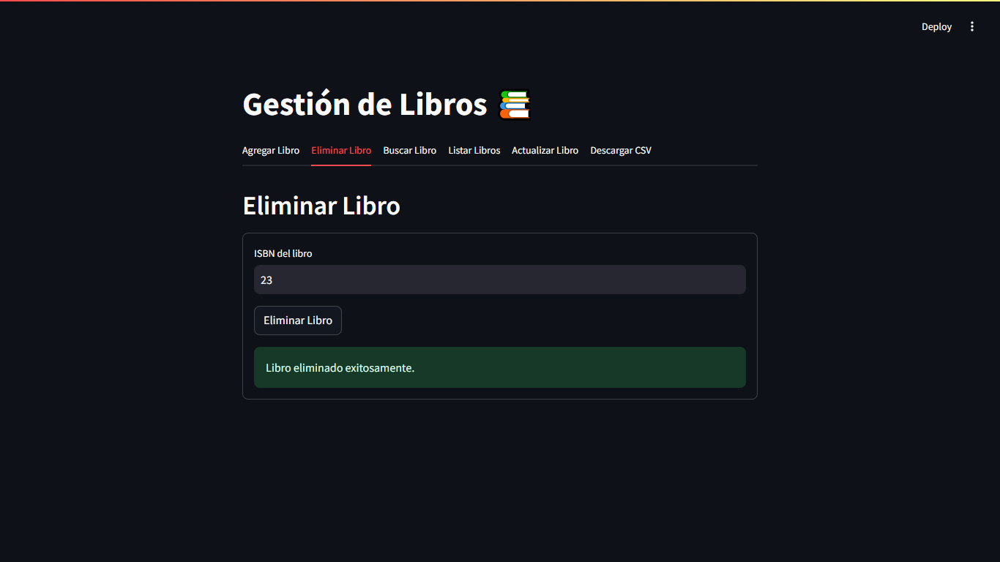

# Gestión de Inventario de una Librería

Práctica de Programación Orientada a Objetos.

## Requisitos

- Python 3.x instalado (preferiblemente Python 3.6+)
- Gestor de paquetes pip (instalado junto con Python por defecto)

## Instalación

1. Descargar los archivos del repositorio.
2. Navega hasta el directorio del proyecto.
3. Instala las dependencias necesarias.

   ```bash
   pip install -r requirements.txt
   ```

   Asegúrate de que estás usando el entorno virtual adecuado si es necesario.

## Uso

1. Ejecuta la aplicación Streamlit.

   ```bash
   streamlit run app.py
   ```

2. Abre tu navegador web y ve a la dirección local proporcionada por Streamlit (por defecto es `http://localhost:8501`).

3. Interactúa con la aplicación según las instrucciones proporcionadas en la interfaz de usuario.

## Interfaz Web





